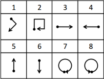
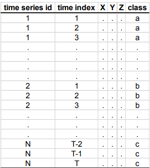

```{r setup, include=FALSE, message=FALSE, warning=FALSE}
knitr::opts_chunk$set(echo = TRUE, message=FALSE, fig.align = "center")
```

<style>
#TOC {
 color: 
 font-family: Calibri;
 background-color:
 border-color: darkred;
}
#header {
 color: darkred;
 font-family: Calibri;
 background-color:
}
body {
 font-family: Calibri;
 }
 
</style> 

# Dimensionality Reduction for Gesture Recognition Time Series Data

## 1. Introduction

Gestures have recently become attractive for spontaneous interaction with consumer electronics and mobile devices in the context of pervasive computing. One related article about this topic starts with the following statement: *“Gestures have recently become attractive for spontaneous interaction with consumer electronics and mobile devices in the context of pervasive computing”*.  

In that work, Liu et al.(2009) present *uWave* to address some challenges to gesture-based interaction and focus on gestures without regard to finger movement, such as sign languages. Unlike statistical methods, uWave only requires a single training sample to start and only employs a three-axis accelerometer that has already appeared in numerous consumer electronics, e.g. Nintendo Wii remote, and mobile device, e.g. Apple iPhone. 

At the end, Liu et al. evaluate uWave with a gesture vocabulary for which they have collected a library of 4480 gestures from eight participants over multiple weeks. The aim is to provide efficient personalized gesture recognition on wide range of devices. The library, *uWaveGestureLibrary*, consists over 4000 instances each of which has the accelerometer readings in three dimensions (i.e. x, y and z). Eight gestures are illustrated below.

<center>

{#id .class width=300 height=250px}
</center>


The main purpose in this assignment is to consuct the **Principal Component Analysis(PCA)**in order to induce the information of 3 dimensions into 1 dimension. Also, the dimensionality of time from 315 is reduced ro 2 which means, we may use much more few columns to describe the gesture of the users than the whole data. Before starting the tasks, the data is downloaded from the url and the necessary adjustments are conducted. 


```{r , message=FALSE, warning=FALSE}
library(tidyverse)
library(kableExtra)
library(RColorBrewer)
library(data.table)
library(patchwork)
library(plotly)
```


## 2. Data Preprocess

There are separate files for each axis and each row corresponds to one gesture in the files. First column has the class information. The information between second and last column is the time ordered observations in the corresponding axis (provided in the file name as X, Y or Z). In order to arrange the data for the following tasks, five functions are created which ease the calculation in the data preprocessing part. The explanation of these functions can be seen below.

**1. preparation function:** Imports the data and renames the columns. <br>
**2. transformation function:** Transforms the wide data format into long data format which is also known as melting the data.<br>
**3. position function:** Calculates the coordinates from accelerometer information.<br>
**4. pca_plot function:** Plots the first component of the Principal Component Analysis for randomly selected two instances of the class.<br>
**5. pca_class function:** Applies Principal Component Analysis to each class separately.

```{r functions}
preparation <- function(from, ax){
  data = fread(from)
  columns = c("class", paste(paste(ax, 'T', sep = ''), 1:(ncol(data)-1), sep = ''))
  colnames(data) = columns
  data
}

transformation <- function(data, ax){
  data = data[, "time series" := 1:nrow(data)]
  data_long = gather(data, "time index", val, paste(ax, 'T1', sep = ''):paste(ax, 'T315', sep = ''))
  colnames(data_long)[4] = ax
  data_long[,3] = unlist(lapply(data_long[,3], function(x){as.numeric(substring(x, 3, length(x) + 4))}))
  data_long = data_long[order(data_long[,2], data_long[,3]),]
  as.data.table(data_long)
}

position <- function(data, ax){
  x = data[data[, .I[3], by = class]$V1][, -1]
  y = t(x)
  y = y[,order(data[data[, .I[3], by = class]$V1][, class])]
  y = cbind(y, apply(y, 2, cumsum))
  y = cbind(y, apply(y[,9:16], 2, cumsum))
  colnames(y) = c(paste(ax, 1:8, sep = "_"), paste("vel", 1:8, sep = "_"), paste("position", 1:8, sep = "_"))
  y
}

pca_plot <- function(value){
  series = unlist(unique(x_train_long[class == value, 2]))
  set.seed(3295)
  randoms = sample(series, 2)
  
  plot_data <- data_long[`time series` %in% randoms,]
  plot_data[,1] <- apply(plot_data[,1], 2, as.character)
  ggplot(plot_data, aes(x = `time index`, y = PCA1, color = `time series`)) +
    geom_point() +
  labs(title = paste("1D Representation of Data For Gesture Class", value, sep = ' '),
       x = "Time Index",
       y = "First Component")
}

pca_class <- function(value){
  data = data_long[data_long$class == value,]
  pca = princomp(data[, 3:5], cor = T)
  summary(pca, loadings=T)
}
```

Later, the **uWave Gesture data** have been imported from the provided source, and the functions are used. 

```{r data from url}
x_train <- preparation("https://drive.google.com/uc?export=download&id=1KDhDT0FE5lkjvn62YTCJ87vZ7A5uS5TT", "X")
y_train <- preparation("https://drive.google.com/uc?export=download&id=1fZCNBdJ40Df5werSu_Ud4GUmCBcBIfaI", "Y")
z_train <- preparation("https://drive.google.com/uc?export=download&id=1jdZ2_NiFil0b4EbLBAfDJ43VQcOgulpf", "Z")

data_wide <- cbind(x_train, y_train[, 2:ncol(y_train)], z_train[, 2:ncol(z_train)])

x_train_long <- transformation(x_train, 'X')
y_train_long <- transformation(y_train, 'Y')
z_train_long <- transformation(z_train, 'Z')

data_long <- x_train_long %>%
  left_join(y_train_long, by = c("time series", "time index", "class")) %>%
  left_join(z_train_long, by = c("time series", "time index", "class"))

data_long <- data_long[, c(2, 3, 4, 5, 6, 1)]
```

The following tables are given to visualize how the data set is organized after using these functions. Tables show times from 1 to 10 with the first 50 rows.

##### X Coordinate Train Table
```{r message=FALSE, warning=FALSE}
head(x_train, 50) %>% select(class, XT1, XT2, XT3 , XT4, XT5, XT6 , XT7, XT8, XT9 , XT10)%>%
  kable(col.names = c("Class","X Train 1","X Train 2", "X Train 3", "X Train 4","X Train 5","X Train 6","X Train 7","X Train 8","X Train 9","X Train 10"))%>%
  kable_styling("striped", "condensed", font_size = 13) %>%
  scroll_box(width = "100%", height = "500px")
```

##### Y Coordinate Train Table
```{r message=FALSE, warning=FALSE}
head(y_train, 50) %>% select(class, YT1, YT2, YT3 , YT4, YT5, YT6 , YT7, YT8, YT9 , YT10)%>%
  kable(col.names = c("Class","Y Train 1","Y Train 2", "Y Train 3", "Y Train 4","Y Train 5","Y Train 6","Y Train 7","Y Train 8","Y Train 9","Y Train 10"))%>%
  kable_styling("striped", "condensed", font_size = 13) %>%
  scroll_box(width = "100%", height = "500px")
```

##### Z Coordinate Train Table
```{r message=FALSE, warning=FALSE}
head(z_train, 50) %>% select(class, ZT1, ZT2, ZT3 , ZT4, ZT5, ZT6 , ZT7, ZT8, ZT9 , ZT10)%>%
  kable(col.names = c("Class","Z Train 1","Z Train 2", "Z Train 3", "Z Train 4","Z Train 5","Z Train 6","Z Train 7","Z Train 8","Z Train 9","Z Train 10"))%>%
  kable_styling("striped", "condensed", font_size = 13) %>%
  scroll_box(width = "100%", height = "500px")
```

##### Wide Data Table with X, Y, and Z Coordinates
```{r message=FALSE, warning=FALSE}
head(data_wide, 50) %>% select(class, XT1, XT2, XT3 , XT4, XT5, XT6 , XT7, XT8, XT9 , XT10, YT1, YT2, YT3 , YT4, YT5, YT6 , YT7, YT8, YT9 , YT10, ZT1, ZT2, ZT3 , ZT4, ZT5, ZT6 , ZT7, ZT8, ZT9 , ZT10)%>% 
  kable(col.names = c("Class","X Train 1","X Train 2", "X Train 3", "X Train 4","X Train 5","X Train 6","X Train 7","X Train 8","X Train 9","X Train 10", "Y Train 1","Y Train 2", "Y Train 3", "Y Train 4","Y Train 5","Y Train 6","Y Train 7","Y Train 8","Y Train 9","Y Train 10", "Z Train 1","Z Train 2", "Z Train 3", "Z Train 4","Z Train 5","Z Train 6","Z Train 7","Z Train 8","Z Train 9","Z Train 10"))%>%
  kable_styling("striped", "condensed", font_size = 13) %>%
  scroll_box(width = "100%", height = "500px")
```

##### X Coordinate Train Table Long Format
```{r message=FALSE, warning=FALSE}
head(x_train_long, 50) %>% select(class, "time series" , "time index" , X)%>%
  kable(col.names = c("Class","Time Series","Time Index", "X"))%>%
  kable_styling("striped", "condensed", font_size = 13) %>%
  scroll_box(width = "100%", height = "500px")
```

##### Y Coordinate Train Table Long Format
```{r message=FALSE, warning=FALSE}
head(y_train_long, 50) %>% select(class, "time series" , "time index" , Y)%>%
  kable(col.names = c("Class","Time Series","Time Index", "Y"))%>%
  kable_styling("striped", "condensed", font_size = 13) %>%
  scroll_box(width = "100%", height = "500px")
```

##### Z Coordinate Train Table Long Format
```{r message=FALSE, warning=FALSE}
head(z_train_long, 50) %>% select(class, "time series" , "time index" , Z)%>%
  kable(col.names = c("Class","Time Series","Time Index", "Z"))%>%
  kable_styling("striped", "condensed", font_size = 13) %>%
  scroll_box(width = "100%", height = "500px")
```

##### Long Data Table with X, Y, and Z Coordinates
```{r message=FALSE, warning=FALSE}  
head(data_long, 50) %>% select("time series" , "time index" , X, Y, Z, class)%>%
  kable(col.names = c("Time Series","Time Index", "X", "Y", "Z", "Class"))%>%
  kable_styling("striped", "condensed", font_size = 13) %>%
  scroll_box(width = "100%", height = "500px")
```

## 3. Tasks

### 3.1. Task A

3D scatter plot as data visualizations for one instance from each class by using plotly package are shown below. The 3D plots somehow fit to the gesture vocabulary, however they are not perfect. 

```{r 3D scatter, warning=FALSE, message=FALSE, eval=FALSE, hide=TRUE}
x_coord <- position(x_train, 'X')
y_coord <- position(y_train, 'Y')
z_coord <- position(z_train, 'Z')


a <-plot_ly(x = x_coord[,"position_1"], y = y_coord[,"position_1"], z = z_coord[,"position_1"], type="scatter3d", mode="markers",  scene='scene1') %>%
  layout(title = "Class 1")
b <-plot_ly(x = x_coord[,"position_2"], y = y_coord[,"position_2"], z = z_coord[,"position_2"], type="scatter3d", mode="markers",  scene='scene2') %>%
  layout(title = "Class 2")
c <-plot_ly(x = x_coord[,"position_3"], y = y_coord[,"position_3"], z = z_coord[,"position_3"], type="scatter3d", mode="markers",  scene='scene3') %>%
  layout(title = "Class 3")
d <-plot_ly(x = x_coord[,"position_4"], y = y_coord[,"position_4"], z = z_coord[,"position_4"], type="scatter3d", mode="markers",  scene='scene4') %>%
  layout(title = "Class 4")
e <-plot_ly(x = x_coord[,"position_5"], y = y_coord[,"position_5"], z = z_coord[,"position_5"], type="scatter3d", mode="markers",  scene='scene5') %>%
  layout(title = "Class 5")
f <-plot_ly(x = x_coord[,"position_6"], y = y_coord[,"position_6"], z = z_coord[,"position_6"], type="scatter3d", mode="markers",  scene='scene6') %>%
  layout(title = "Class 6")
g <-plot_ly(x = x_coord[,"position_7"], y = y_coord[,"position_7"], z = z_coord[,"position_7"], type="scatter3d", mode="markers",  scene='scene7') %>%
  layout(title = "Class 7")
h <-plot_ly(x = x_coord[,"position_8"], y = y_coord[,"position_8"], z = z_coord[,"position_8"], type="scatter3d", mode="markers",  scene='scene8') %>%
  layout(title = "Class 8")


fig <- subplot(a, b,c,d,e,f,g,h, nrows=8) 
fig

```

```{r  message=FALSE, warning=FALSE}
x_coord <- position(x_train, 'X')
y_coord <- position(y_train, 'Y')
z_coord <- position(z_train, 'Z')


plot_ly(x = x_coord[,"position_1"], y = y_coord[,"position_1"], z = z_coord[,"position_1"], type="scatter3d", mode="markers") %>%
  layout(title = "Class 1")
plot_ly(x = x_coord[,"position_2"], y = y_coord[,"position_2"], z = z_coord[,"position_2"], type="scatter3d", mode="markers") %>%
  layout(title = "Class 2")
plot_ly(x = x_coord[,"position_3"], y = y_coord[,"position_3"], z = z_coord[,"position_3"], type="scatter3d", mode="markers") %>%
  layout(title = "Class 3")
plot_ly(x = x_coord[,"position_4"], y = y_coord[,"position_4"], z = z_coord[,"position_4"], type="scatter3d", mode="markers") %>%
  layout(title = "Class 4")
plot_ly(x = x_coord[,"position_5"], y = y_coord[,"position_5"], z = z_coord[,"position_5"], type="scatter3d", mode="markers") %>%
  layout(title = "Class 5")
plot_ly(x = x_coord[,"position_6"], y = y_coord[,"position_6"], z = z_coord[,"position_6"], type="scatter3d", mode="markers",) %>%
  layout(title = "Class 6")
plot_ly(x = x_coord[,"position_7"], y = y_coord[,"position_7"], z = z_coord[,"position_7"], type="scatter3d", mode="markers") %>%
  layout(title = "Class 7")
plot_ly(x = x_coord[,"position_8"], y = y_coord[,"position_8"], z = z_coord[,"position_8"], type="scatter3d", mode="markers") %>%
  layout(title = "Class 8")
```

- **For Class 1:** 90 degree turn is obtained, so this instance fits with Gesture 1. 
- **For Class 2:** 3 sharp 90 degree turns is obtained, so this instance fits with Gesture 2. 
- **For Class 3:** by changing the viewing angle, a similar shape to Gesture 3 is obtained.
- **For Class 4:** by changing the viewing angle, a similar shape to Gesture 4 is obtained.
- **For Class 5:** by changing the viewing angle, a similar shape to Gesture 5 is obtained.
- **For Class 6:** by changing the viewing angle, a similar shape to Gesture 6 is obtained.
- **For Class 7:** 360 degree change is obtained, so this instance fits with Gesture 7.
- **For Class 8:** 360 degree change is obtained, so this instance fits with Gesture 8.

### 3.2. Task B

The data is provided as a regular data matrix (i.e. each row represents an instance and columns represent the time index of the observations). On the other hand, this is an example of multivariate time series where we have X, Y and Z variables. Our aim is to reduce this multivariate time series to a univariate one with a dimensionality reduction approach. One way to achieve this task is to transform the data into the following format.

<center>

{#id .class width=350 height=400px}
</center>


Data has been already transformed into long format in the data preprocess part. In order to get 1D information from 3D, we should apply Principal component Analysis. However, to do so, we should check the scale of the data. If the variables are not in the same scale, standardization process is needed in order to get variables in the same scale. X, Y, and Z data all have 0 mean and 1 standard deviation, which means we can continue with Principal Component Analysis.

```{r}
pca <- princomp(data_long[,3:5], cor = T)
summary(pca, loadings=T)

data_long[, PCA1 := pca$scores[,1]]
```

The summary output shows that with one principal component, 49% of the data can be explained. 

<center>
**PC1 = c(x=0.427, y=0.721, z=0.546)**
</center>

Therefore, first principal component can be used in order to represent the 3D coordinate data as 1D. Plots belong to random two intances of each classes can be seen below. The time series are similar to each other, which means PCA may be useful to reduce the dimensionality of the data. 

```{r fig.show="hold", out.width="60%"}
pca_plot(1)
pca_plot(2)
pca_plot(3)
pca_plot(4)
pca_plot(5)
pca_plot(6)
pca_plot(7)
pca_plot(8)

```


It can be concluded that samples from same classes generally resemble each other. However it may not be convenient to differentiate classes by investigating only the first principal component. For example, differentiating class 7 and class 8 is not easy since the shape of the graphs resemble each other.It should be noted that, as in the summary of the PCA, one component can only explain almost the half of the data which means, we lose some information by reducing dimensionality.

### 3.3. Task C

Now, the data will be filtered for each class and Principal Component Analysis will be applied eight times. We may expect to get better results with this approach, because we reduce the variance among the classes. 

##### For Class 1
```{r }
pca_class(1)  
```
##### For Class 2
```{r }
pca_class(2)
```
##### For Class 3
```{r }
pca_class(3)  
```
##### For Class 4
```{r }
pca_class(4) 
```
##### For Class 5
```{r }
pca_class(5)  
```
##### For Class 6
```{r }
pca_class(6) 
```
##### For Class 7
```{r }
pca_class(7) 
```
##### For Class 8
```{r }
pca_class(8) 
```
When we look at the summaries of above R codes, 

- **For class 1:** 46% of the data can be explained with one component for  class 1 whereas it was 49% for the general PCA. Therefore, seperating classes reduce the explainability of one dimension.
- **For class 2:** 51% of the data can be explained with one component for  class 1 whereas it was 49% for the general PCA. Therefore, seperating classes increse the explainability of one dimension.
- **For class 3:** 54% of the data can be explained with one component for  class 1 whereas it was 49% for the general PCA. Therefore, seperating classes increse the explainability of one dimension.
- **For class 4:** 55% of the data can be explained with one component for  class 1 whereas it was 49% for the general PCA. Therefore, seperating classes increse the explainability of one dimension.
- **For class 5:** 64% of the data can be explained with one component for  class 1 whereas it was 49% for the general PCA. Therefore, seperating classes increse the explainability of one dimension.
- **For class 6:** 57% of the data can be explained with one component for  class 1 whereas it was 49% for the general PCA. Therefore, seperating classes increse the explainability of one dimension.
- **For class 7:** 51% of the data can be explained with one component for  class 1 whereas it was 49% for the general PCA. Therefore, seperating classes increse the explainability of one dimension.
- **For class 8:** 61% of the data can be explained with one component for  class 1 whereas it was 49% for the general PCA. Therefore, seperating classes increse the explainability of one dimension.

In general, we can say that applying PCA for almost every class gives better results than applying to all class. 

### 3.4. Task D

Our aim now is to visualize the time series in reduced dimensions for classification purposes. We compute the distance between the time series for each axis using the original representation (i.e. a row represents individual time series, column is the time index and entries are the observations) over each axis and sum them up to obtain a final distance measure. Then, multidimensional scaling is applied to this distance matrix to represent each time series on a 2-dimensional feature space. 

The purpose of this approach is that there are 315 time ordered information in this dataset. This is a great number in order to consider as feature number in a model therefore, reducing the number of features may be a good approach. To do so, we use multi dimensional scaling (MDS) approach. Firstly, we need to create the distance matrix. We can get distance matrix by using **dist** function, and **manhattan** method, since we need to sum all distances of axes and this summation will be in a way like manhattan. 

```{r}
x_train_distance <- as.matrix(dist(x_train[, 2:316], method = 'manhattan'))
y_train_distance <- as.matrix(dist(y_train[, 2:316], method = 'manhattan'))
z_train_distance <- as.matrix(dist(z_train[, 2:316], method = 'manhattan'))

data_distance <- x_train_distance + y_train_distance + z_train_distance
```

After constructing the distance matrix, multidimensional scaling meyhod can be used. Visualization of the observations using the reduced features and color-code the points is presented below.

```{r}
mds <- cmdscale(data_distance, k=2)
mds <- data.table(unlist(apply(x_train[, 1], 2, as.character)), D1 = mds[,1], D2 = mds[,2])

plot<-ggplot(mds, aes(x = D1, y = D2, color = class)) + geom_point() + theme_minimal()+ theme(axis.text.x = element_text(angle=65, vjust=0.6))+
  scale_color_brewer(palette="Set1")+
  labs(title = "Multidimensional Scaling",
       subtitle = "Gesture dataset",
       x = "First Dimension",
       y = "Second Dimension")
plot

plot + facet_wrap(~class)

```

Following conclusions can be obtained from the above plot:

- Observations from the same classes are tend to cluster mostly. 
- Some classes are very close to each other such as class 2 & class 7, class 1 & class 6, class 4 & class 8.
- Class 3 is very widespread.
- Some classes are distinguishable but not all of them. For example, class 5 &  class 2 are distinguishable whereas class 1 & class 6 are almost indistinguishable. 
- The gestures with the opposite moves can be seen distinctly in the classification plot.
- Multidimensional Scaling method is an effective way to distinguish some classes from other but not for all the classes.
- The variance is very large for some classes therefore some classes overlap.

## References
[1. Article](https://www.yecl.org/publications/liu09percom.pdf)<br>
[2. Assignment](https://moodle.boun.edu.tr/pluginfile.php/673871/mod_resource/content/0/IE582_Fall20_Homework2.pdf)<br>
